<h2>TensorFlow-FlexUNet-Image-Segmentation-Gastrointestinal-Polyp (2025/08/10)</h2>

This is the first experiment of Image Segmentation for Gastrointestinal-Polyp (Kvasir-Polyp) ,
 based on our 
 <a href="https://github.com/sarah-antillia/TensorFlow-FlexUNet-Image-Segmentation-Model">
<b>TensorFlowFlexUNet (TensorFlow Flexible UNet Image Segmentation Model for Multiclass)</b></a>
 
and a 512x512 pixels 
<a href="https://drive.google.com/file/d/1HL0Ybt-zfya_1_o8NwoaIwtS6BkFKDWn/view?usp=sharing">
<b>Augmented-Kvasir-Polyp-PNG-ImageMask-Dataset.zip</b></a>, 
which was derived by us from 
<a href="https://www.kaggle.com/datasets/debeshjha1/kvasirseg"><b>Kvasir-SEG Data (Polyp segmentation & detection)</b></a>
  

As demonstrated in <a href="https://github.com/sarah-antillia/TensorFlow-FlexUNet-Image-Segmentation-STARE-Retinal-Vessel">
TensorFlow-FlexUNet-Image-Segmentation-STARE-Retinal-Vessel</a> ,
 our Multiclass TensorFlowFlexUNet, which uses categorized masks, can also be applied to 
single-class image segmentation models. 
This is because it inherently treats the background as one category and your single-class mask data as 
a second category. In essence, your single-class segmentation model will operate with two categorized classes within our Multiclass UNet framework.
 
 
Please see also our experiment 
<a href="https://github.com/sarah-antillia/Tensorflow-Image-Segmentation-Gastrointestinal-Polyp">
Tensorflow-Image-Segmentation-Gastrointestinal-Polyp</a>.
  

<b>Acutual Image Segmentation for 512x512 Kvasir-Polyp images</b> 

As shown below, the inferred masks predicted by our segmentation model, which was trained on 
the augmented dataset, appear similar to the ground truth masks.
 
 

 
<table>
<tr>
<th>Input: image</th>
<th>Mask (ground_truth)</th>
<th>Prediction: inferred_mask</th>
</tr>
<tr>
<td>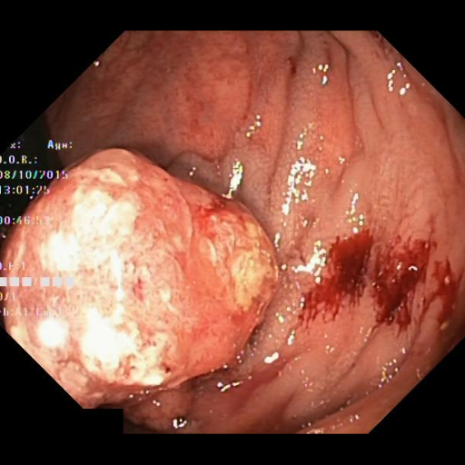</td>
<td>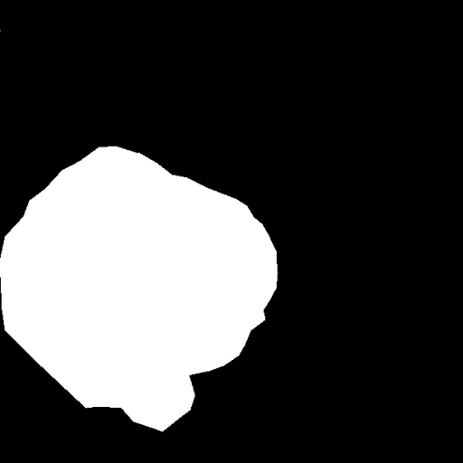</td>
<td></td>
</tr>
<tr>
<td>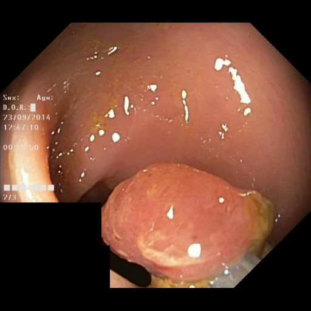</td>
<td>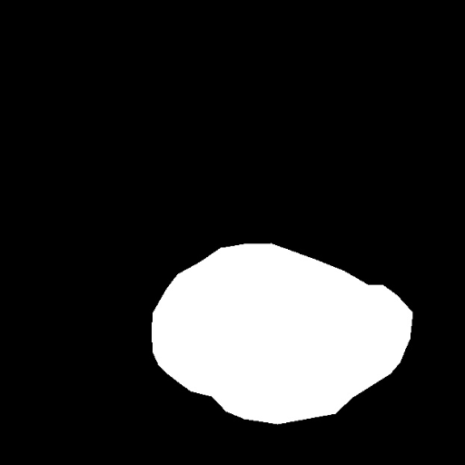</td>
<td></td>
</tr>
<tr>
<td>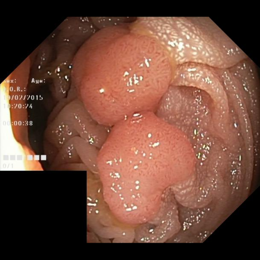</td>
<td></td>
<td>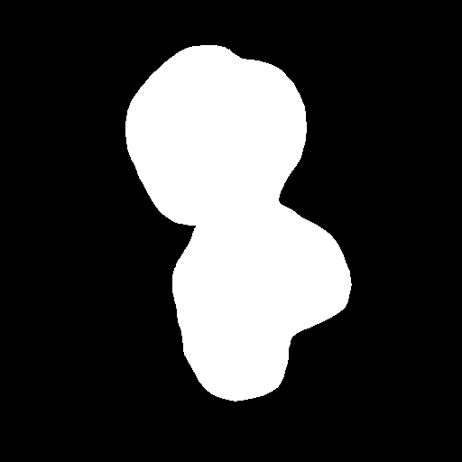</td>
</tr>
</table>

 
<h3>1. Dataset Citation</h3>
The image dataset used here has been taken from the following kaggle web site. 
<a href="https://www.kaggle.com/datasets/debeshjha1/kvasirseg">Kvasir-SEG Data (Polyp segmentation & detection)</a>
  
<b>About Dataset</b>

Kvasir-SEG information:
The Kvasir-SEG dataset (size 46.2 MB) contains 1000 polyp images and their corresponding ground truth 
from the Kvasir Dataset v2. The images' resolution in Kvasir-SEG varies from 332x487 to 1920x1072 pixels. 
The images and its corresponding masks are stored in two separate folders with the same filename. 
The image files are encoded using JPEG compression, facilitating online browsing. 
The open-access dataset can be easily downloaded for research and educational purposes.
 
 
<b>Applications of the Dataset</b> 

The Kvasir-SEG dataset is intended to be used for researching and developing new and improved methods 
for segmentation, detection, localization, and classification of polyps. 
Multiple datasets are prerequisites for comparing computer vision-based algorithms, and this dataset 
is useful both as a training dataset or as a validation dataset. These datasets can assist the 
development of state-of-the-art solutions for images captured by colonoscopes from different manufacturers. 
Further research in this field has the potential to help reduce the polyp miss rate and thus improve 
examination quality. The Kvasir-SEG dataset is also suitable for general segmentation and bounding box 
detection research. In this context, the datasets can accompany several other datasets from a wide 
range of fields, both medical and otherwise.
 
 
<b>Ground Truth Extraction</b> 

We uploaded the entire Kvasir polyp class to Labelbox and created all the segmentations using this application. 
The Labelbox is a tool used for labeling the region of interest (ROI) in image frames, i.e., the polyp regions 
for our case. We manually annotated and labeled all of the 1000 images with the help of medical experts. 
After annotation, we exported the files to generate masks for each annotation. 
The exported JSON file contained all the information about the image and the coordinate points for generating 
the mask. To create a mask, we used ROI coordinates to draw contours on an empty black image and fill the 
contours with white color. The generated masks are a 1-bit color depth images. The pixels depicting polyp tissue, 
the region of interest, are represented by the foreground (white mask), while the background (in black) does not 
contain positive pixels. Some of the original images contain the image of the endoscope position marking probe, 
ScopeGuide TM, Olympus Tokyo Japan, located in one of the bottom corners, seen as a small green box. 
As this information is superfluous for the segmentation task, we have replaced these with black boxes in the 
Kvasir-SEG dataset.
 
 
See also:Kvasir-SEG 
<a href="https://paperswithcode.com/dataset/kvasir-seg">
https://paperswithcode.com/dataset/kvasir-seg
</a>

 

<h3>
<a id="2">
2 Kvasir-Polyp ImageMask Dataset
</a>
</h3>
 If you would like to train this Kvasir-Polyp Segmentation model by yourself,
 please download the dataset from the google drive  
<a href="https://drive.google.com/file/d/1HL0Ybt-zfya_1_o8NwoaIwtS6BkFKDWn/view?usp=sharing">
<b>Augmented-Kvasir-Polyp-PNG-ImageMask-Dataset.zip</b></a>.
 
, expand the downloaded ImageMaskDataset and put it under <b>./dataset</b> folder to be
<pre>
./dataset
└─Kvasir-Polyp
    ├─test
    │   ├─images
    │   └─masks
    ├─train
    │   ├─images
    │   └─masks
    └─valid
        ├─images
        └─masks
</pre>
 
<b>Kvasir-Polyp Statistics</b> 
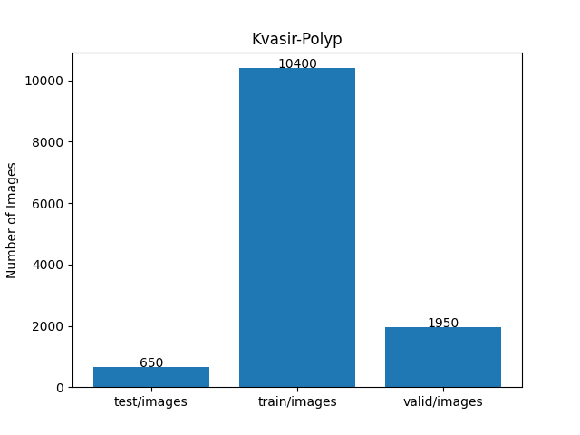 
 

On the derivation of the dataset, please refer to the following Python scripts: 
<li><a href="./generator/ImageMaskDatasetGenerator.py">ImageMaskDatasetGenerator.py</a></li>
<li><a href="./generator/split_master.py">split_master.py</a></li>
 

As shown above, the number of images of train and valid datasets is large enough to use for a training set of our segmentation model.
 
 
<b>Train_images_sample</b> 
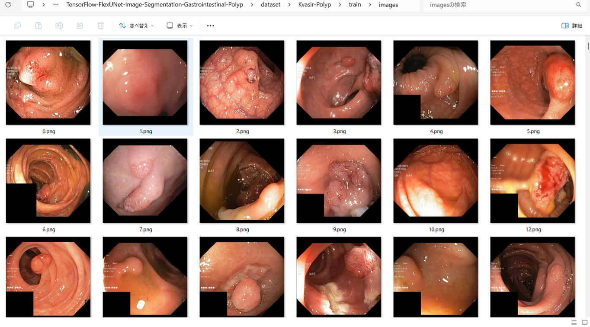
 
<b>Train_masks_sample</b> 
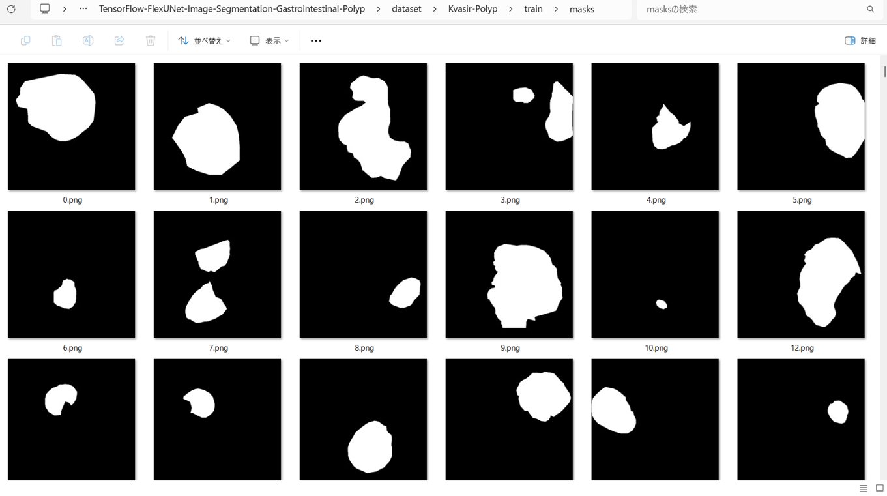
 
<h3>
3 Train TensorFlowFlexUNet Model
</h3>
 We trained Kvasir-Polyp TensorFlowFlexUNet Model by using the following
<a href="./projects/TensorFlowFlexUNet/Kvasir-Polyp/train_eval_infer.config"> <b>train_eval_infer.config</b></a> file.  
Please move to ./projects/TensorFlowFlexUNet/Kvasir-Polyp and run the following bat file. 
<pre>
>1.train.bat
</pre>
, which simply runs the following command. 
<pre>
>python ../../../src/TensorFlowFlexUNetTrainer.py ./train_eval_infer.config
</pre>

<b>Model parameters</b> 
Defined a small <b>base_filters = 16 </b> and large <b>base_kernels = (9,9)</b> for the first Conv Layer of Encoder Block of 
<a href="./src/TensorFlowFlexUNet.py">TensorFlowFlexUNet.py</a> 
and a large num_layers (including a bridge between Encoder and Decoder Blocks).
<pre>
[model]
;You may specify your own UNet class derived from our TensorFlowFlexModel
model         = "TensorFlowFlexUNet"
generator     =  False
image_width    = 512
image_height   = 512
image_channels = 3
num_classes    = 2

base_filters   = 16
base_kernels   = (9,9)
num_layers     = 8
dropout_rate   = 0.04
dilation       = (1,1)
</pre>
<b>Learning rate</b> 
Defined a very small learning rate.  
<pre>
[model]
learning_rate  = 0.00007
</pre>
<b>Loss and metrics functions</b> 
Specified "categorical_crossentropy" and <a href="./src/dice_coef_multiclass.py">"dice_coef_multiclass"</a>. 
<pre>
[model]
loss           = "categorical_crossentropy"
metrics        = ["dice_coef_multiclass"]
</pre>
<b>Dataset class</b> 
Specifed <a href="./src/ImageCategorizedMaskDataset.py">ImageCategorizedMaskDataset</a> class. 
<pre>
[dataset]
class_name    = "ImageCategorizedMaskDataset"
</pre>
 
<b>Learning rate reducer callback</b> 
Enabled learing_rate_reducer callback, and a small reducer_patience.
<pre> 
[train]
learning_rate_reducer = True
reducer_factor     = 0.4
reducer_patience   = 4
</pre>
<b>Early stopping callback</b> 
Enabled early stopping callback with patience parameter.
<pre>
[train]
patience      = 10
</pre>

<b>RGB Color map</b> 
rgb color map dict for Kvasir-Polyp 1+1 classes. 
<pre>
[mask]
mask_file_format = ".png"
;
;RGB colors          (Polyp:white)
rgb_map = {(0,0,0):0,(255,255,255):1, }

</pre>

<b>Epoch change inference callback</b> 
Enabled <a href="./src/EpochChangeInfereuncer.py">epoch_change_infer callback</a></b>. 
<pre>
[train]
epoch_change_infer       = True
epoch_change_infer_dir   =  "./epoch_change_infer"
num_infer_images         = 6
</pre>

By using this callback, on every epoch_change, the inference procedure can be called
 for 6 images in <b>mini_test</b> folder. This will help you confirm how the predicted mask changes 
 at each epoch during your training process.    

<b>Epoch_change_inference output at starting (epoch 1,2,3)</b> 
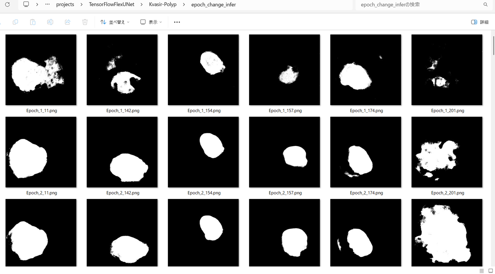 
 
<b>Epoch_change_inference output at middlepoint (epoch 28,29,30)</b> 
 
 
<b>Epoch_change_inference output at ending (epoch 58,59,60)</b> 
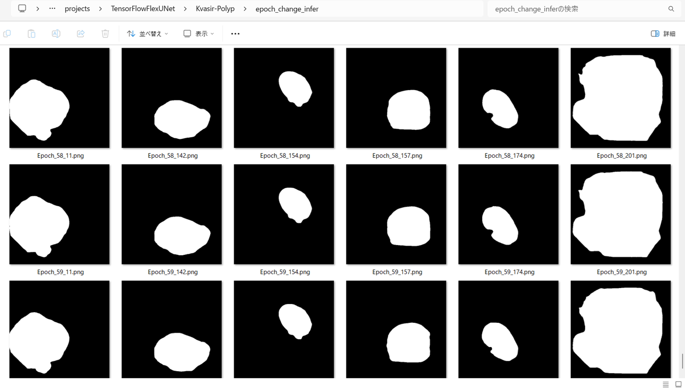 
 
In this experiment, the training process was terminated at epoch 60.  
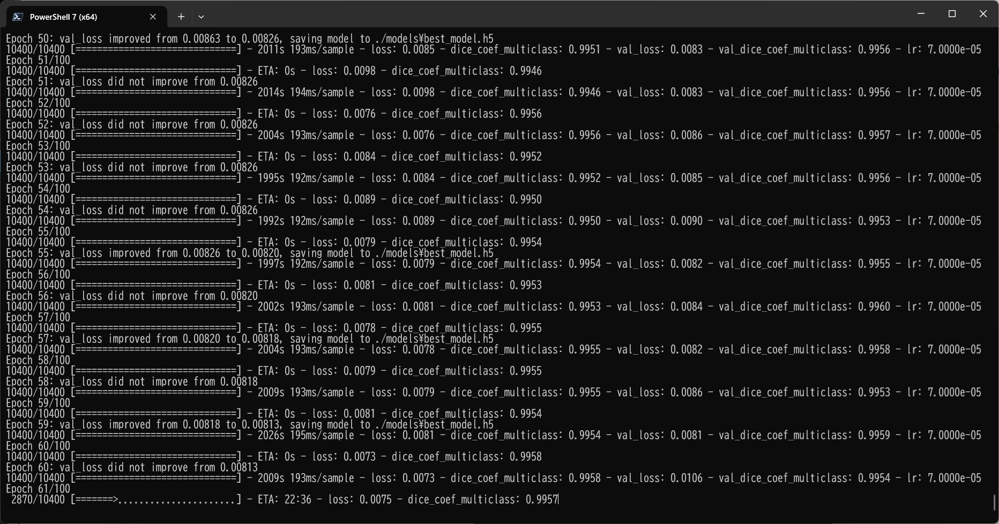 
 

<a href="./projects/TensorFlowFlexUNet/Kvasir-Polyp/eval/train_metrics.csv">train_metrics.csv</a> 
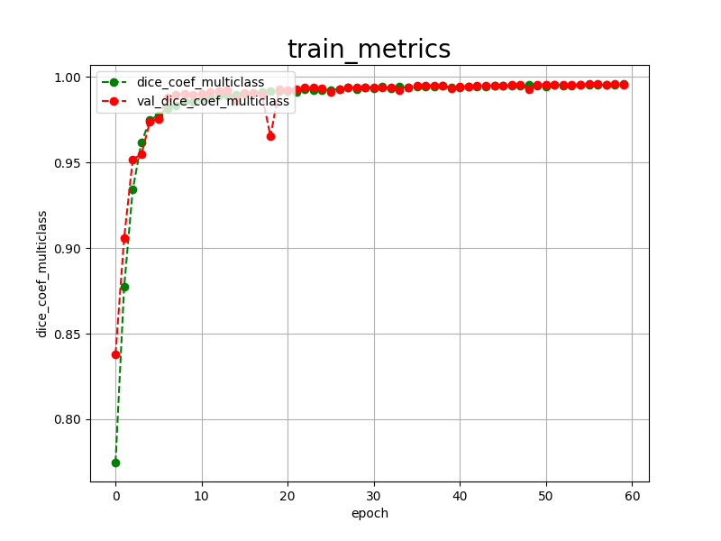 

 
<a href="./projects/TensorFlowFlexUNet/Kvasir-Polyp/eval/train_losses.csv">train_losses.csv</a> 
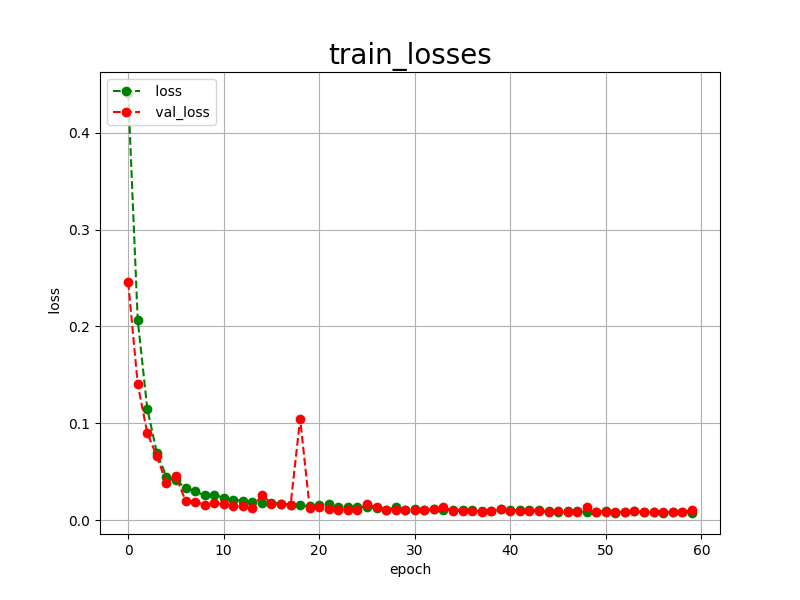 

 

<h3>
4 Evaluation
</h3>
Please move to <b>./projects/TensorFlowFlexUNet/Kvasir-Polyp</b> folder, 
and run the following bat file to evaluate TensorFlowFlexUNet model for Kvasir-Polyp. 
<pre>
./2.evaluate.bat
</pre>
This bat file simply runs the following command.
<pre>
python ../../../src/TensorFlowFlexUNetEvaluator.py ./train_eval_infer_aug.config
</pre>

Evaluation console output: 
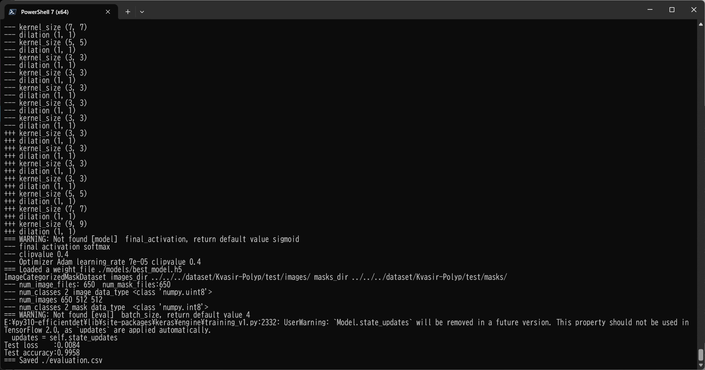
  

<a href="./projects/TensorFlowFlexUNet/Kvasir-Polyp/evaluation.csv">evaluation.csv</a> 
The loss (categorical_crossentropy) to this Kvasir-Polyp/test was very low and dice_coef_multiclass 
very high as shown below.
 
<pre>
categorical_crossentropy,0.0084
dice_coef_multiclass,0.9958
</pre>
 

<h3>
5 Inference
</h3>
Please move <b>./projects/TensorFlowFlexUNet/Kvasir-Polyp</b> folder 
,and run the following bat file to infer segmentation regions for images by the Trained-TensorFlowFlexUNet model for Kvasir-Polyp. 
<pre>
./3.infer.bat
</pre>
This simply runs the following command.
<pre>
python ../../../src/TensorFlowFlexUNetInferencer.py ./train_eval_infer_aug.config
</pre>

<b>mini_test_images</b> 
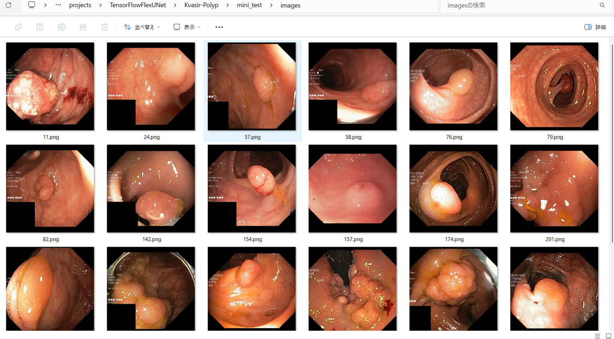 
<b>mini_test_mask(ground_truth)</b> 
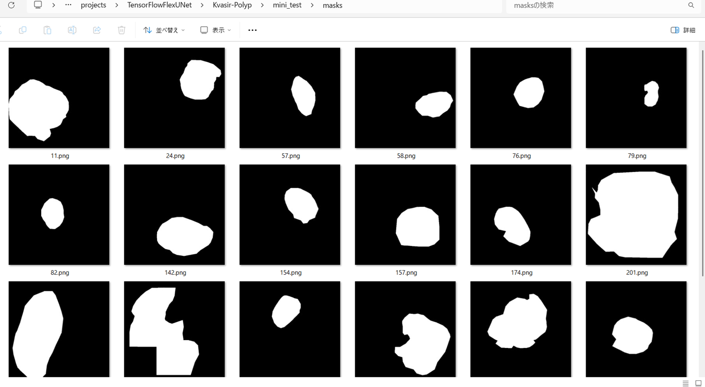 

<b>Inferred test masks</b> 
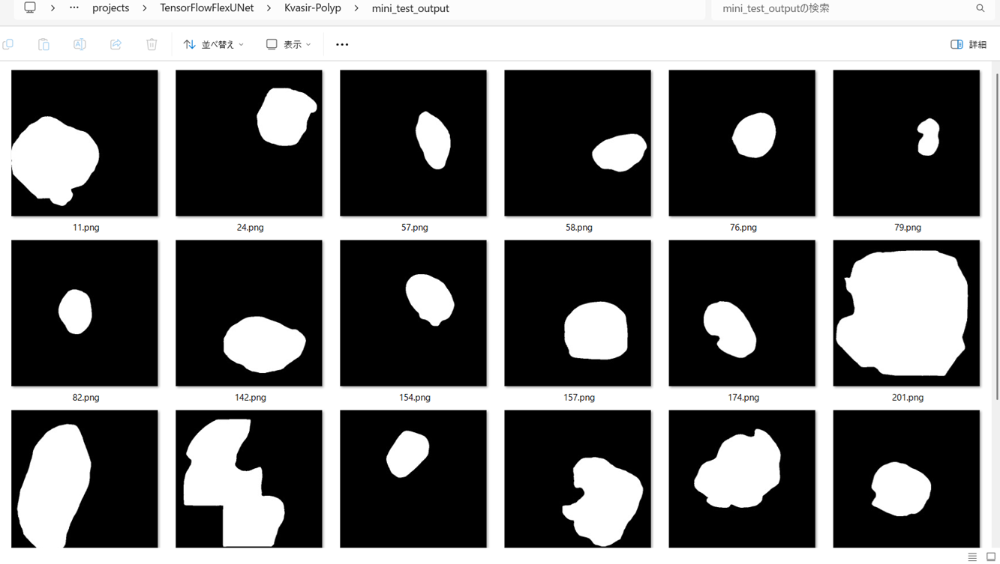 
 

<b>Enlarged images and masks of 512x512 pixels</b> 
<table>
<tr>
<th>Image</th>
<th>Mask (ground_truth)</th>
<th>Inferred-mask</th>
</tr>

<tr>
<td>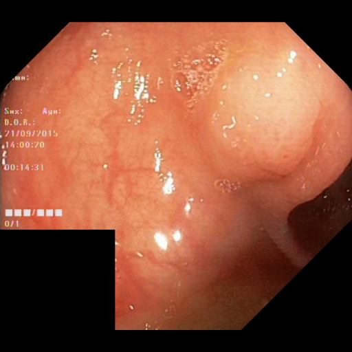</td>
<td></td>
<td>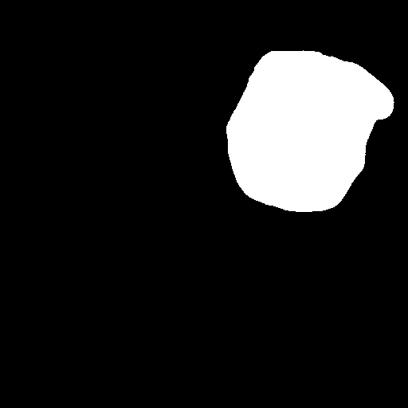</td>
</tr>

<tr>
<td>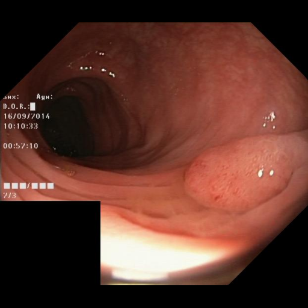</td>
<td></td>
<td>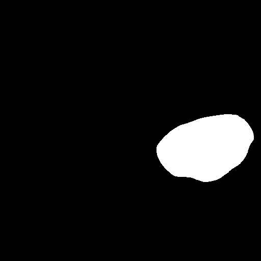</td>
</tr>

<tr>
<td>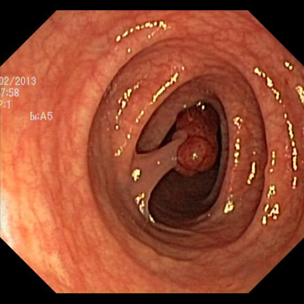</td>
<td></td>
<td>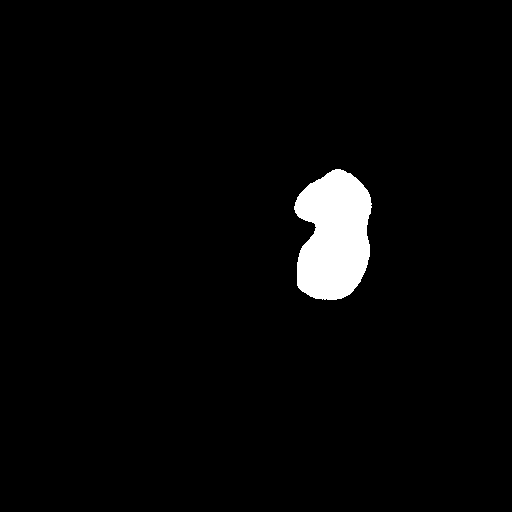</td>
</tr>

<tr>
<td>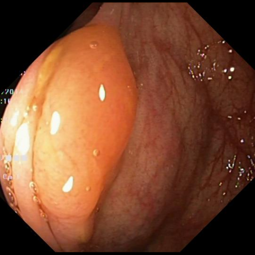</td>
<td>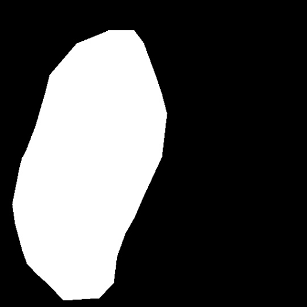</td>
<td></td>
</tr>

<tr>
<td>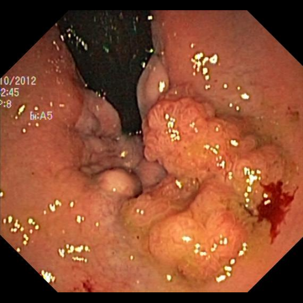</td>
<td></td>
<td>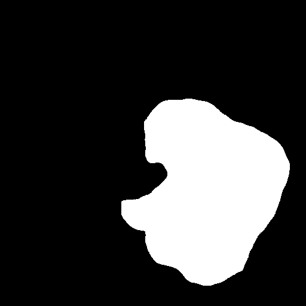</td>
</tr>

<tr>
<td></td>
<td></td>
<td></td>
</tr>
</table>

 
<h3>
References
</h3>

<b>1. Kvasir-SEG Data (Polyp segmentation & detection)</b> 
<a href="https://www.kaggle.com/datasets/debeshjha1/kvasirseg">
https://www.kaggle.com/datasets/debeshjha1/kvasirseg</a>
 
 
<b>2. Kvasir-SEG: A Segmented Polyp Dataset</b> 
Debesh Jha, Pia H. Smedsrud, Michael A. Riegler, P˚al Halvorsen, 
Thomas de Lange, Dag Johansen, and H˚avard D. Johansen 
<a href="https://arxiv.org/pdf/1911.07069v1.pdf">
https://arxiv.org/pdf/1911.07069v1.pdf
</a>
 
 
<b>3. DeepLabV3Plus-Tf2.x</b> 
TanyaChutani 
<a href="https://github.com/TanyaChutani/DeepLabV3Plus-Tf2.x/blob/master/notebook/DeepLab_V3_Plus.ipynb">
https://github.com/TanyaChutani/DeepLabV3Plus-Tf2.x/blob/master/notebook/DeepLab_V3_Plus.ipynb
</a>
 
 
<b>4. TensorflowSwinUNet-Image-Segmentation-Augmented-GastrointestinalPolyp</b> 
Toshiyuki Arai @antillia.com 
<a href="https://github.com/sarah-antillia/TensorflowSwinUNet-Image-Segmentation-Augmented-GastrointestinalPolyp">
https://github.com/sarah-antillia/TensorflowSwinUNet-Image-Segmentation-Augmented-GastrointestinalPolyp
</a>
 
 
<b>5. TensorflowMultiResUNet-Segmentation-Gastrointestinal-Polyp</b> 
Toshiyuki Arai @antillia.com 
<a href="https://github.com/sarah-antillia/TensorflowMultiResUNet-Segmentation-Gastrointestinal-Polyp">
https://github.com/sarah-antillia/TensorflowMultiResUNet-Segmentation-Gastrointestinal-Polyp
</a>
 
 
<b>6. TensorflowUNet3Plus-Segmentation-Gastrointestinal-Polyp</b> 
Toshiyuki Arai @antillia.com 
<a href="https://github.com/sarah-antillia/TensorflowUNet3Plus-Segmentation-Gastrointestinal-Polyp">
https://github.com/sarah-antillia/TensorflowUNet3Plus-Segmentation-Gastrointestinal-Polyp
</a>
 
 
<b>7. TensorflowEfficientUNet-Segmentation-Gastrointestinal-Polyp</b> 
Toshiyuki Arai @antillia.com 
<a href="https://github.com/sarah-antillia/TensorflowEfficientUNet-Image-Segmentation-Augmented-GastrointestinalPolyp">
https://github.com/sarah-antillia/TensorflowEfficientUNet-Image-Segmentation-Augmented-GastrointestinalPolyp
</a>
 
 
<b>8. TensorflowSharpUNet-Segmentation-Gastrointestinal-Polyp</b> 
Toshiyuki Arai @antillia.com 
<a href="https://github.com/sarah-antillia/TensorflowSharpUNet-Image-Segmentation-Augmented-GastrointestinalPolyp">
https://github.com/sarah-antillia/TensorflowSharpUNet-Image-Segmentation-Augmented-GastrointestinalPolyp
</a>
 
 
<b>9. TensorflowU2Net-Segmentation-Gastrointestinal-Polyp</b> 
Toshiyuki Arai @antillia.com 
<a href="https://github.com/sarah-antillia/TensorflowU2Net-Image-Segmentation-Augmented-GastrointestinalPolyp">
https://github.com/sarah-antillia/TensorflowU2Net-Image-Segmentation-Augmented-GastrointestinalPolyp
</a>
 

